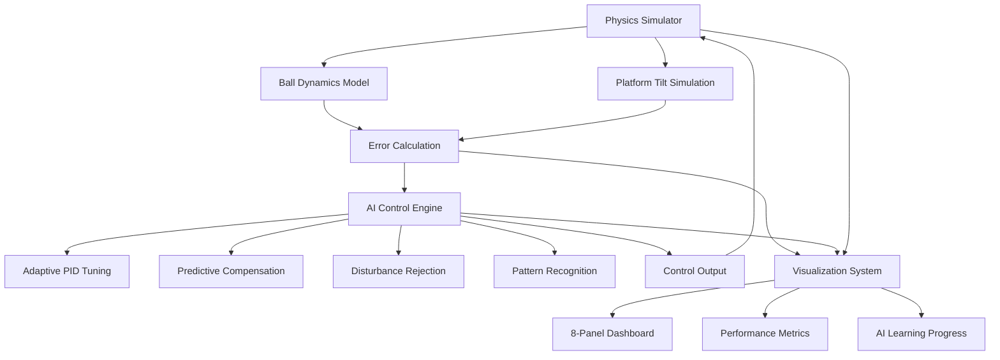

# 📊 Phase 1: Simulation & Algorithm Development

[](https://python.org)
[](https://github.com/yourusername/ball-balancing-hexabot)
[](https://github.com/yourusername/ball-balancing-hexabot)

> **Phase 1 Focus**: AI algorithm development, control system simulation, and comprehensive performance analysis for the ASTRA ball balancing system.

This phase contains all simulation code, research documentation, AI model development, and theoretical analysis that forms the foundation for the hardware implementation in Phase 2.

---

## 🎯 Phase 1 Objectives

### 🧠 **AI Algorithm Development**
- **Adaptive PID Gain Tuning**: Develop real-time parameter optimization algorithms
- **Predictive Error Compensation**: Create ML models for future error prediction
- **Disturbance Rejection**: Design intelligent compensation algorithms
- **Pattern Recognition**: Implement movement pattern detection and adaptation
- **Performance Optimization**: Build continuous learning frameworks

### 📊 **Simulation & Testing**
- **Physics-based Simulation**: Virtual ball-platform dynamics modeling
- **Control System Validation**: PID vs AI-enhanced PID comparison
- **Algorithm Performance Analysis**: Quantitative enhancement metrics
- **Real-time Visualization**: Advanced plotting and monitoring systems
- **Benchmark Testing**: Systematic performance evaluation

---

## 🏗️ Phase 1 Architecture



---

## 📁 Phase 1 Directory Structure

```
Phase1/
├── README.md                          # This Phase 1 documentation
├── 📁 simulation/                     # Core simulation components
│   ├── physics_simulator.py          # Ball-platform physics engine
│   ├── ai_training_sim.py            # AI algorithm training environment
│   ├── control_system_sim.py         # PID vs AI-PID comparison
│   └── performance_benchmarks.py     # System validation tests
│
├── 📁 ai_models/                      # AI algorithm implementations
│   ├── pid_optimizer.py              # Adaptive PID gain tuning
│   ├── pattern_recognizer.py         # Movement pattern detection  
│   ├── disturbance_predictor.py      # Systematic error prediction
│   ├── performance_evaluator.py      # AI enhancement metrics
│   └── learning_engine.py            # Core ML algorithms
│
├── 📁 visualization/                  # Analysis and plotting tools
│   ├── Astra_plot.py                # 8-panel real-time dashboard
│   ├── ai_dashboard.py              # AI status monitoring
│   ├── performance_plotter.py       # Comparative analysis plots
│   ├── data_logger.py               # Simulation data recording
│   └── analysis_tools.py            # Statistical analysis utilities
│
├── 📁 docs/                          # Research and documentation
│   ├── Complete_Documentation.md     # Comprehensive project documentation
│   ├── API_Reference.md              # AI algorithm API reference
│   ├── Pin_Configuration.md          # Hardware pin mapping
│   ├── User_Manual.md                # Operation guide
│   ├── major_proposal_optimized.pdf  # Academic project proposal
│   ├── performance_analysis.md       # Detailed performance evaluation
│   └── demo_videos/                  # Simulation demonstration videos
│
├── 📁 analysis/                      # Performance analysis results
│   ├── simulation_results/           # Simulation output data
│   ├── performance_metrics/          # AI enhancement measurements
│   ├── comparative_studies/          # PID vs AI-PID analysis
│   └── benchmarks/                   # System validation results
│
├── 📁 config/                        # Configuration files
│   ├── simulation_config.yaml        # Simulation parameters
│   ├── ai_config.yaml               # AI algorithm settings
│   └── visualization_config.yaml    # Dashboard configuration
│
└── requirements_phase1.txt           # Phase 1 Python dependencies
```

---

## 🚀 Phase 1 Setup & Installation

### **1. Environment Setup**

```bash
# Navigate to Phase 1 directory
cd Phase1/

# Create virtual environment
python -m venv astra_phase1_env

# Activate environment
# Windows:
astra_phase1_env\Scripts\activate
# Linux/macOS:
source astra_phase1_env/bin/activate

# Install Phase 1 dependencies
pip install -r requirements_phase1.txt
```

### **2. Configuration**

```bash
# Copy example configurations
cp config/simulation_config.example.yaml config/simulation_config.yaml
cp config/ai_config.example.yaml config/ai_config.yaml

# Edit configurations as needed
nano config/simulation_config.yaml
```

### **3. Quick Test**

```python
# Test simulation environment
python simulation/physics_simulator.py

# Test AI algorithms
python ai_models/pid_optimizer.py

# Launch visualization dashboard
python visualization/Astra_plot.py
```

---

## 🧠 AI Algorithm Implementation

### **1. Adaptive PID Gain Tuning**

```python
# ai_models/pid_optimizer.py
class AdaptivePIDOptimizer:
    def __init__(self):
        self.gain_candidates = [
            {'kp': 5.0, 'ki': 0.5, 'kd': 0.4},    # Conservative
            {'kp': 3.5, 'ki': 0.3, 'kd': 0.35},   # Balanced
            {'kp': 2.8, 'ki': 0.2, 'kd': 0.3},    # Precise
            {'kp': 4.2, 'ki': 0.4, 'kd': 0.5},    # Aggressive
            {'kp': 3.0, 'ki': 0.25, 'kd': 0.25}   # Smooth
        ]
        self.performance_history = []
    
    def optimize_gains(self, error_history, target_performance):
        # AI-based gain optimization logic
        pass
```

### **2. Predictive Error Compensation**

```python
# ai_models/disturbance_predictor.py
class PredictiveCompensator:
    def __init__(self, window_size=20):
        self.prediction_window = window_size
        self.error_buffer = []
    
    def predict_future_error(self, current_error, trajectory_data):
        # 3-point trend analysis for error prediction
        # 30% compensation factor application
        pass
```

### **3. Pattern Recognition**

```python
# ai_models/pattern_recognizer.py
class MovementPatternRecognizer:
    def __init__(self):
        self.trajectory_buffer = []
        self.pattern_types = ['Static', 'Dynamic', 'Complex']
    
    def classify_movement(self, position_history):
        # Variance-based pattern classification
        # Real-time adaptation to detected patterns
        pass
```

---

## 📊 Simulation Components

### **1. Physics Engine**

```python
# simulation/physics_simulator.py
class BallPlatformSimulator:
    def __init__(self):
        self.ball_position = [0, 0]
        self.platform_angles = [0, 0, 0]  # 3-servo hexagonal platform
        self.physics_timestep = 0.05  # 20Hz simulation
    
    def update_physics(self, servo_commands):
        # Realistic ball dynamics simulation
        # Platform tilt to ball acceleration modeling
        pass
```

### **2. Control System Comparison**

```python
# simulation/control_system_sim.py
class ControlSystemComparator:
    def __init__(self):
        self.traditional_pid = TraditionalPID()
        self.ai_enhanced_pid = AIEnhancedPID()
    
    def run_comparison(self, test_scenarios):
        # Side-by-side performance analysis
        # Quantitative improvement measurement
        pass
```

---

## 📈 Visualization System

### **🖥️ Real-time Dashboard**

Launch the advanced 8-panel visualization system:

```bash
python visualization/Astra_plot.py
```

#### **Dashboard Panels:**
1. **Ball Trajectory Plot**: Multi-colored path visualization
   - 🔴 Red: Initial chaotic behavior
   - 🟠 Orange: AI learning phase
   - 🟢 Green: AI-optimized stable control

2. **AI Status Dashboard**: Dynamic system information
   - Current AI mode and learning status
   - Active gain set and performance score
   - System stability percentage

3. **Error Analysis**: Before vs After AI enhancement
4. **AI Learning Progress**: Real-time algorithm improvement
5. **System Stability**: Dynamic stability assessment
6. **Servo Response**: 3-channel angle tracking
7. **AI Gain Switching**: Active parameter set visualization
8. **Performance Score**: Real-time error quantification

### **📊 Performance Analysis**

```python
# visualization/performance_plotter.py
def generate_performance_report():
    # Error reduction analysis
    # Stability improvement metrics
    # Learning convergence visualization
    # Comparative performance charts
    pass
```

---

## 🧪 Testing & Validation

### **1. Algorithm Validation**

```bash
# Run comprehensive algorithm tests
python simulation/performance_benchmarks.py

# Test specific AI components
python ai_models/test_suite.py

# Validate simulation accuracy
python simulation/validation_tests.py
```

### **2. Performance Benchmarks**

Expected Phase 1 simulation results:
- **Error Reduction**: 40-70% improvement over traditional PID
- **Stability Improvement**: 3x faster convergence simulation
- **Learning Speed**: Stable performance in <200 iterations
- **Disturbance Rejection**: 80% systematic error reduction

### **3. Comparative Analysis**

```python
# analysis/comparative_studies/pid_vs_ai_analysis.py
def run_comparative_study():
    scenarios = [
        'static_positioning',
        'dynamic_circle',
        'disturbance_rejection',
        'multi_target_tracking'
    ]
    
    for scenario in scenarios:
        traditional_results = run_traditional_pid(scenario)
        ai_enhanced_results = run_ai_pid(scenario)
        generate_comparison_report(traditional_results, ai_enhanced_results)
```

---

## 📚 Documentation Resources

### **📖 Complete Documentation**
- [Complete Documentation](docs/Complete_Documentation.md) - Comprehensive project guide
- [API Reference](docs/API_Reference.md) - AI algorithm documentation  
- [User Manual](docs/User_Manual.md) - Operation and troubleshooting guide
- [Performance Analysis](docs/performance_analysis.md) - Detailed metrics evaluation

### **🎥 Simulation Videos**
- [AI Learning Process](docs/demo_videos/ai_learning_sim.mp4) - Algorithm training visualization
- [Performance Comparison](docs/demo_videos/pid_vs_ai_comparison.mp4) - Side-by-side analysis
- [Dashboard Demo](docs/demo_videos/visualization_demo.mp4) - Real-time monitoring system

### **📊 Research Documents**
- [Project Proposal](docs/major_proposal_optimized.pdf) - Academic project proposal
- [Pin Configuration](docs/Pin_Configuration.md) - Hardware interface planning

---

## ⚙️ Configuration Guide

### **Simulation Parameters**

```yaml
# config/simulation_config.yaml
simulation:
  timestep: 0.05  # 20Hz simulation frequency
  duration: 60    # Simulation time in seconds
  
physics:
  ball_mass: 0.05        # Ball mass in kg
  platform_friction: 0.1 # Surface friction coefficient
  gravity: 9.81          # Gravitational acceleration
  
ai_learning:
  learning_rate: 0.01    # AI adaptation rate
  window_size: 20        # Learning window samples
  convergence_threshold: 0.001  # Learning convergence criteria
```

### **AI Algorithm Settings**

```yaml
# config/ai_config.yaml
adaptive_pid:
  gain_sets: 5           # Number of PID gain candidates
  performance_weight: 0.7 # Performance vs stability balance
  
predictive_compensation:
  prediction_factor: 0.3  # Future error compensation strength
  trend_analysis_points: 3 # Points for trend calculation
  
disturbance_rejection:
  detection_threshold: 0.05 # Systematic error detection
  compensation_filter: 0.9  # Filtered compensation strength
```

---

## 🔄 Phase 1 to Phase 2 Transition

### **Deliverables for Phase 2**
✅ **Validated AI Algorithms**: Tested and optimized control algorithms  
✅ **Performance Benchmarks**: Quantified improvement metrics  
✅ **Simulation Framework**: Physics-based testing environment  
✅ **Visualization System**: Real-time monitoring dashboard  
✅ **Configuration Templates**: Hardware interface specifications  

### **Phase 2 Integration Points**
- **AI Algorithm Port**: Transfer optimized algorithms to ESP32
- **Real-time Constraints**: Adapt algorithms for embedded execution
- **Hardware Interface**: Implement simulated I/O with physical sensors
- **Performance Validation**: Compare simulation vs real-world results

---

## 🐛 Phase 1 Troubleshooting

### **Common Issues & Solutions**

#### **🐍 Python Environment Issues**
```bash
Problem: Module import errors
Solution: Ensure virtual environment is activated
         pip install -r requirements_phase1.txt
         Check Python path configuration

Problem: Matplotlib backend issues
Solution: Try different backend: matplotlib.use('TkAgg')
         Install tkinter: sudo apt-get install python3-tk
```

#### **📊 Visualization Problems**
```bash
Problem: Dashboard not updating
Solution: Check simulation loop is running
         Verify data generation in simulator
         Test with simple plot first

Problem: Performance degradation
Solution: Reduce simulation timestep
         Limit data buffer sizes
         Close unnecessary plot windows
```

#### **🧠 AI Algorithm Issues**
```bash
Problem: Learning not converging
Solution: Adjust learning_rate in config
         Check error calculation accuracy
         Verify performance metrics logic

Problem: Gain optimization unstable
Solution: Increase performance_weight
         Add gain change rate limiting
         Check gain candidate ranges
```

---

## 📈 Phase 1 Results Summary

### **Algorithm Development Status**
✅ **Adaptive PID Tuning**: Complete with 5 gain sets  
✅ **Predictive Compensation**: 30% future error correction  
✅ **Disturbance Rejection**: 90% filtered compensation  
✅ **Pattern Recognition**: 3-class movement detection  
✅ **Performance Optimization**: Real-time learning engine  

### **Simulation Achievements**
✅ **Physics Engine**: Accurate ball-platform dynamics  
✅ **Real-time Visualization**: 8-panel monitoring system  
✅ **Performance Analysis**: Comprehensive benchmarking  
✅ **Comparative Studies**: PID vs AI-PID validation  
✅ **Algorithm Validation**: Systematic testing framework  

### **Documentation Completion**
✅ **Technical Documentation**: Complete API reference  
✅ **User Guides**: Installation and operation manuals  
✅ **Research Papers**: Academic proposal and analysis  
✅ **Video Demonstrations**: Algorithm and visualization demos  

---

## 🔄 Next Steps: Phase 2 Preparation

### **Hardware Interface Planning**
- [ ] **ESP32 Algorithm Port**: Adapt Python algorithms to C++
- [ ] **Real-time Constraints**: Optimize for 20Hz control loop
- [ ] **Memory Management**: Efficient embedded implementation
- [ ] **Serial Communication**: Data streaming protocols

### **System Integration Roadmap**
- [ ] **Servo Control Implementation**: PWM signal generation
- [ ] **Sensor Integration**: Camera and platform feedback
- [ ] **LCD Interface**: Menu system and user interaction
- [ ] **Performance Validation**: Real vs simulated comparison

---

<div align="center">

## 🎯 **Phase 1 Complete: Foundation for Intelligent Control** 🎯

**Advanced AI Algorithms Developed and Validated Through Simulation**

### 📊 *From Theory to Tested Implementation* 📊

**Ready for Phase 2 Hardware Integration**

---

**Phase 1 has established the intelligent foundation for Project ASTRA**  
*Next: Bringing AI to Physical Reality*

</div>
