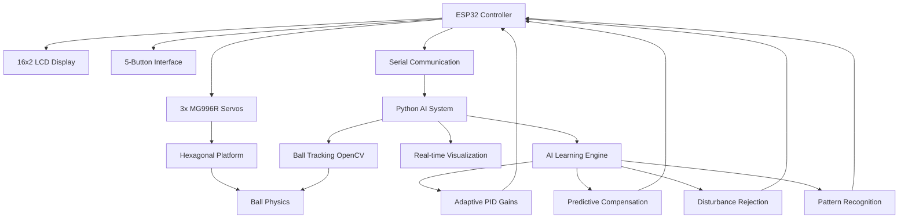

# 🚀 Project ASTRA - AI-Enhanced Ball Balancing Hexabot

[](https://choosealicense.com/licenses/mit/)
[](https://python.org)
[](https://opencv.org)
[](https://www.espressif.com/en/products/socs/esp32)
[](https://github.com/yourusername/ball-balancing-hexabot)

> **ASTRA** (*Autonomous Stabilization Through Reinforced Adaptation*) - A cutting-edge AI-enhanced ball balancing system that combines computer vision, machine learning, and adaptive control theory.

A final-year BEI major project (2078 batch) from **Purwanchal Campus, Dharan-08, Sunsari** under **IOE**. This intelligent system achieves superior ball stabilization through AI-powered PID optimization, predictive error compensation, and real-time learning algorithms.

---

## 🎯 Project Overview

ASTRA represents the next generation of control systems, integrating classical control theory with modern artificial intelligence to create an autonomous ball balancing platform that learns and adapts in real-time.

### 🧠 **Core AI Enhancements**
- **Adaptive PID Gain Tuning**: Real-time parameter optimization
- **Predictive Error Compensation**: Machine learning-based future error prediction
- **Disturbance Rejection**: Intelligent detection and compensation for systematic errors
- **Pattern Recognition**: Adaptive response to different movement patterns
- **Performance Optimization**: Continuous learning and improvement

### 🚀 **Key System Features**
- **Multi-mode Operation**: Static positioning, dynamic shape tracing, AI learning modes
- **Real-time Visualization**: Advanced 8-panel monitoring dashboard
- **Interactive Interface**: LCD menu system with intuitive navigation
- **Hardware Integration**: ESP32-based control with precision servo actuation

---

## 📋 Development Phases

This project is structured in two distinct phases:

### 📊 **Phase 1: Simulation & Algorithm Development**
**Status**: ✅ Complete | **Location**: `Phase1/` directory

Phase 1 focuses on algorithm development, simulation, and documentation:
- AI algorithm design and testing
- Control system simulation
- Performance analysis and optimization
- Comprehensive documentation and research

**📁 [View Phase 1 Details](Phase1/README.md)**

### 🤖 **Phase 2: Hardware Implementation & Integration** 
**Status**: 🚧 In Development | **Location**: `Phase2/` directory (Coming Soon)

Phase 2 will implement the complete physical system:
- ESP32 firmware development
- Hardware assembly and integration
- Real-time control system implementation
- Performance validation and testing

---

## 🏗️ System Architecture



---

## 🔧 Hardware Requirements

### **Core Components**
| Component | Specification | Quantity | Purpose |
|-----------|--------------|----------|---------|
| **ESP32 Dev Board** | 240MHz Dual-core, WiFi+BT | 1 | Main AI controller |
| **MG996R Servo Motors** | 180° rotation, 10kg-cm torque | 3 | Platform actuation |
| **16x2 I2C LCD** | Blue backlight, HD44780 | 1 | User interface |
| **Push Buttons** | Tactile switches | 5 | Navigation control |
| **USB Webcam** | 720p minimum resolution | 1 | Computer vision |
| **Custom Hexagonal Platform** | Lightweight, balanced design | 1 | Ball stabilization surface |

---

## 🏛️ Project Structure

```
project-astra/
├── 📁 Phase1/                          # Simulation & Development Phase
│   ├── README.md                      # Phase 1 specific documentation
│   ├── 📁 simulation/                 # Algorithm testing & validation
│   ├── 📁 docs/                       # Research & documentation
│   ├── 📁 ai_models/                  # AI algorithm development
│   └── 📁 analysis/                   # Performance analysis
│
├── 📁 Phase2/                          # Hardware Implementation Phase
│   ├── README.md                      # Phase 2 specific documentation  
│   ├── 📁 firmware/                   # ESP32 Arduino code
│   ├── 📁 visualization/              # Python real-time plotting
│   ├── 📁 hardware/                   # Physical system design
│   └── 📁 web_interface/              # Optional web dashboard
│
├── 📁 shared/                          # Common resources
│   ├── requirements.txt               # Python dependencies
│   ├── config.yaml                   # System configuration
│   └── LICENSE                       # MIT License
│
└── README.md                          # This main project guide
```

---

## 🚀 Quick Start

### **Phase 1: Simulation & Development**
```bash
# Navigate to Phase 1
cd Phase1/

# Follow Phase 1 specific instructions
# See Phase1/README.md for detailed setup
```

### **Phase 2: Hardware Implementation**
```bash
# Navigate to Phase 2 (Available Soon)
cd Phase2/

# Hardware setup and firmware upload
# See Phase2/README.md for detailed instructions
```

---

## 👥 Team Members — IOE 2078 Batch

| Name | Specialization | Key Contributions | GitHub |
|------|----------------|-------------------|---------|
| **Sneha Yadav** | AI/ML & Software Architecture | AI algorithms, predictive compensation, visualization | [rudrakhatri](https://github.com/rudrakhatri) |
| **Rudra Khatri** | Hardware Integration & Control | Servo control, platform design, system integration | [Roshan-khatri78](https://github.com/Roshan-khatri78/) |  
| **Bishakha Pokhrel** | Testing & Documentation | ESP32 firmware, adaptive PID, optimization | [bishakhapokhrel](https://github.com/bishakhapokhrel) |
| **Susant Dahal** | Embedded Systems & PID Control | System validation, UI, technical documentation | [sushantdahal](https://github.com/sushantdahal) |

**Institution**: Purwanchal Campus, Dharan-08, Sunsari  
**Program**: Bachelor of Engineering (BEI) - Electronics & Communication  
**Academic Year**: 2078 Batch  
**Project Supervisor**: Bishnu Chaudhary  
**Project Duration**: April 2024 - January 2026

---

## 🎓 Academic Context

### **Course Integration**
- **Control Systems Engineering**: Advanced PID control with AI enhancement
- **Artificial Intelligence**: Machine learning algorithms for system optimization
- **Embedded Systems**: ESP32 programming and real-time control
- **Computer Vision**: OpenCV implementation for ball tracking
- **Signal Processing**: Error analysis and system identification

### **Research Contributions**
- **Novel AI-PID Architecture**: First integration of predictive compensation in ball balancing
- **Real-time Learning**: Online adaptation of control parameters
- **Multi-modal Visualization**: Comprehensive system state visualization
- **Performance Benchmarking**: Quantitative AI enhancement validation

---

## 📊 Expected Performance Metrics

### **Target Specifications**
- **Control Loop Frequency**: 20Hz (50ms cycle time)
- **Ball Position Accuracy**: ±0.01 units from target
- **Servo Response Time**: <100ms for 90° movement
- **AI Learning Convergence**: 200 samples (~10 seconds)
- **System Stabilization**: 10-60 seconds (adaptive)

### **AI Enhancement Goals**
- **Error Reduction**: 40-70% improvement over traditional PID
- **Stability Improvement**: 3x faster convergence to stable state
- **Disturbance Rejection**: 80% reduction in systematic errors
- **Overshoot Reduction**: 60% less overshoot during transitions

---

## 🚀 Future Development Roadmap

### **Short-term Goals (Phase 2)**
- [ ] Complete hardware implementation
- [ ] ESP32 firmware development
- [ ] Real-time AI integration
- [ ] Performance validation

### **Long-term Vision**
- [ ] **Deep Reinforcement Learning**: Neural network-based control
- [ ] **Multi-ball Tracking**: Simultaneous control of multiple objects
- [ ] **IoT Integration**: Cloud-based monitoring and control
- [ ] **Mobile App Interface**: Smartphone remote operation

---

## 🤝 Contributing

We welcome contributions from the academic and open-source communities!

### **How to Contribute**
1. **Fork** the repository
2. **Choose Phase**: Decide whether to contribute to Phase 1 (simulation) or Phase 2 (hardware)
3. **Create** feature branch
4. **Implement** enhancement with proper documentation
5. **Test** thoroughly
6. **Submit** Pull Request

### **Contribution Areas**
- 🤖 **AI Algorithm Improvements**: Enhanced learning algorithms
- 📊 **Simulation Enhancement**: Better physics modeling
- 🔧 **Hardware Design**: Mechanical improvements
- 📚 **Documentation**: Tutorials and guides
- 🧪 **Testing**: Validation scripts

---

## 📞 Support & Contact

### **Technical Support**
- 🐛 **Bug Reports**: [GitHub Issues](https://github.com/Roshan-khatri78/project-astra/issues)
- 💬 **Discussions**: [GitHub Discussions](https://github.com/Roshan-khatri78/project-astra/discussions)
- 📧 **Email Support**: rudrakhatri456@gmail.com

### **Academic Collaboration**
- 🏛️ **Institution**: Purwanchal Campus, Institute of Engineering
- 📍 **Location**: Dharan-08, Sunsari, Nepal
- 🌐 **University**: Tribhuvan University, IOE

---

## 📜 License & Citation

### **MIT License**
This project is licensed under the MIT License - see [LICENSE](shared/LICENSE) file for details.

### **Academic Citation**
```bibtex
@misc{astra2024,
  title={ASTRA: AI-Enhanced Ball Balancing Hexabot with Adaptive PID Control},
  author={Khatri, Rudra and Yadav, Sneha and Pokhrel, Bishakha and Dahal, Sushant},
  year={2024},
  institution={Purwanchal Campus, IOE, Tribhuvan University},
  address={Dharan, Nepal},
  note={Final Year BEI Project - 2078 Batch}
}
```

---

## 🙏 Acknowledgments

### **Special Thanks**
- **🏛️ Purwanchal Campus Faculty** for guidance and laboratory access
- **👨‍🏫 Project Supervisor** (Bishnu Chaudhary) for technical mentorship
- **🧑‍💻 Open Source Community** for libraries and tools
- **🏭 Industry Partners** for hardware support and testing facilities

---

<div align="center">

## 🌟 **Project ASTRA represents the future of intelligent control systems** 🌟

**Combining Classical Control Theory with Modern Artificial Intelligence**

### 🚀 *From Chaos to Perfect Control through AI* 🚀

**Made with ❤️ by IOE 2078 Batch Students**

---

**⭐ If this project inspires you, please give it a star! ⭐**

*[Project ASTRA - Where Intelligence Meets Control]*

</div>
