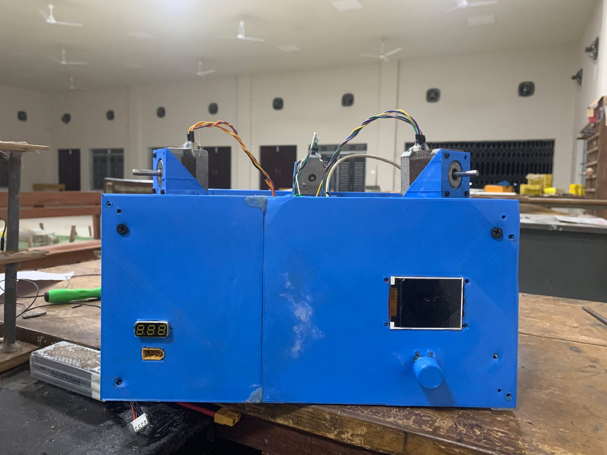

<div align="center">

# ⚡ ASTRA — Vision-Based Ball Balancing Platform

**A closed-loop control system that balances a ball on a tilting platform using computer vision and PID control**




*Final Year Project · Department of Electronics and Computer Engineering*
*Purwanchal Campus, Institute of Engineering, Tribhuvan University · March 2026*

</div>

---

## 📌 Overview

ASTRA is a vision-based closed-loop control system that detects the position of a ball on a tilting hexagonal platform using a camera and OpenCV, then uses a PID controller running on an ESP32 to drive stepper motors and keep the ball balanced at the center.

The system is built in two phases — a low-cost servo prototype and a high-precision stepper build — so builders can choose based on budget and accuracy needs.

---

## 🔀 Choose Your Build

| | Phase 1 — Servo Build | Phase 2 — Stepper Build ⭐ |
|---|---|---|
| **Cost** | ~$35 | ~$90 |
| **Motors** | MG996R Servos ×3 | NEMA 17 Steppers ×3 |
| **Accuracy** | ±1–2° | ±0.05° |
| **Driver** | Direct PWM | TB6600 ×3 @ 24V 5A |
| **UI** | I2C LCD + Push Buttons | 2" TFT + Rotary Encoder |
| **Best for** | Learning, simple wiring | Research, publication-ready results |

---

## 🔄 Why We Moved from Phase 1 to Phase 2

Phase 1 was built as a working prototype to validate the concept quickly and cheaply. Once the core logic (vision + PID + serial) was confirmed to work, Phase 2 addressed every hardware limitation that Phase 1 exposed.

**Phase 1 Limitations (Servo Build)**

| Problem | Impact |
|---|---|
| Servos have ±1–2° angular backlash | Ball oscillated around setpoint, couldn't settle cleanly |
| PWM-based control is coarse | No microstepping — jerky platform motion |
| Low torque at mid-range angles | Platform sagged under ball weight, introduced mechanical error |
| I2C LCD too slow to update | Couldn't monitor PID values in real-time during tuning |
| No encoder feedback on servos | Open-loop actuation — position drift over time |

**Why Phase 2 Fixes This (Stepper Build)**

| Improvement | Benefit |
|---|---|
| NEMA 17 steppers — 200 steps/rev | Deterministic position, zero backlash |
| TB6600 microstepping (1/32 step) | Smooth, fine platform motion |
| Higher torque at all angles | Stable platform regardless of ball position |
| TFT display + rotary encoder | Live PID tuning without reflashing firmware |
| Dual ESP32 architecture | Motor control and UI run on separate cores — no lag |
| Watchdog safety system | Auto-homes platform if PC disconnects mid-run |

> **Bottom line:** Phase 1 proves the idea. Phase 2 makes it precise enough for research and publication.

---

## 🧠 How It Works

The system runs as a continuous closed-loop across three modules:

**Module 1 — Vision Processing (PC)**
- Mobile phone camera streams live video to PC via DroidCam
- OpenCV pipeline: Gaussian blur → HSV thresholding → morphological open/close → contour detection → image moments → EMA smoothing
- Outputs ball center coordinates (x, y) relative to platform center

**Module 2 — Control & Actuation (ESP32 Master)**
- Receives coordinates over UART serial communication
- Computes positional error and runs discrete PID controller
- Converts PID output to platform tilt angles via inverse kinematics
- Commands 3 stepper motors through TB6600 drivers
- Watchdog safety: homes motors if serial signal is lost

**Module 3 — UI & Monitoring (ESP32 Display)**
- 2" TFT display shows live ball position, error, and system status
- Rotary encoder allows real-time PID parameter tuning without reflashing

```
┌─────────────────────────────────────────────────────────────┐
│                     CLOSED LOOP FLOW                        │
├─────────────┬──────────────┬──────────────┬─────────────────┤
│  📷 Camera  │  🖥️ PC/OpenCV │  📡 ESP32    │  ⚙️ Platform    │
│  (DroidCam) │              │  Master      │                 │
│             │  HSV detect  │              │                 │
│  Capture  ──►  Track ball ──►  PID calc  ──►  Tilt motors   │
│  frame      │  Compute err │  Inv. kinem  │  Correct ball   │
│             │  Send X,Y    │  Step motors │                 │
│      ◄──────────────────────────────────── Visual feedback  │
└─────────────┴──────────────┴──────────────┴─────────────────┘
```

---

## 📊 Performance Results (Phase 2)

| Metric | Value |
|---|---|
| Settling Time | ~2.8 seconds |
| Overshoot | 8.5% |
| Steady-State Error | 2–3 pixels |
| Vision Frame Rate | 20–30 FPS |
| Control Loop | ~30 Hz |

*Tested over 3 trials under controlled disturbances. Full results in the project report.*

---

## 🔧 Hardware (Phase 2)

| Component | Spec | Qty |
|---|---|---|
| ESP32 Dev Board | Dual-core MCU | 2 |
| NEMA 17 Stepper Motor | Precise actuation | 3 |
| TB6600 Stepper Driver | Microstepping, high-current | 3 |
| TFT Display | 2" SPI | 1 |
| Rotary Encoder | PID tuning UI | 1 |
| 12V SMPS | 24V mains power supply | 1 |
| Buck Converter | 24V → 5V logic rail | 2 |
| 3D Printed Platform | Hexagonal tilting plate | 1 |

**Total Build Cost: NPR 20,600 (~$155)**

> Phase 1 replaces steppers + drivers with MG996R servos and uses an I2C LCD instead of the TFT. Total cost ~$35.

---

## 💻 Software & Libraries

**Embedded (Arduino IDE / C++)**
- `HardwareSerial.h` — UART communication
- `AccelStepper` — Stepper motor control with acceleration
- `math.h` — Inverse kinematics calculations

**Vision & Dashboard (Python 3.x)**
- `opencv-python` — Ball detection and tracking
- `pySerial` — Serial communication with ESP32
- `matplotlib` — Real-time performance graphs
- `numpy` — Numerical processing

---

## ⚙️ PID Parameters (Tuned)

```
Kp = 1.8    (proportional — immediate error response)
Ki = 0.04   (integral — eliminates steady-state error)
Kd = 0.65   (derivative — reduces oscillation)
```

Control law:
```
u[k] = Kp·e[k] + Ki·Σe[k]·Δt + Kd·(e[k] - e[k-1]) / Δt
```

---

## 🚀 Quick Start

### Phase 1 — Servo Build

```bash
git clone https://github.com/Roshan-khatri78/ball-balancing-hexabot.git
cd ball-balancing-hexabot/Phase1
# Follow Phase1/README.md
```

### Phase 2 — Stepper Build

```bash
git clone https://github.com/Roshan-khatri78/ball-balancing-hexabot.git
cd ball-balancing-hexabot/Phase2
# Follow Phase2/README.md
```

**Prerequisites:**
```bash
pip install opencv-python pyserial matplotlib numpy
# Flash firmware via Arduino IDE (ESP32 board package required)
# Install DroidCam on your phone + PC
```

---

## 📁 Project Structure

```
ball-balancing-hexabot/
├── Phase1/                    # Servo prototype
│   ├── simulation/            # MATLAB/Python simulation
│   ├── ai_models/
│   └── firmware/              # ESP32 Arduino code
├── Phase2/                    # Stepper build
│   ├── firmware/              # ESP32 Master controller
│   ├── motor_controller/      # Stepper + IK logic
│   └── ui_controller/         # TFT display + encoder
├── docs/
│   └── hardware/              # Wiring diagrams
├── visualization/             # Python dashboard
├── shared/                    # Common utilities
└── README.md
```

---

## ⚠️ Known Limitations

- Vision performance degrades under poor or uneven lighting
- Camera alignment offset introduces a small steady-state error
- PID parameters require manual re-tuning if mechanical setup changes
- Serial latency adds a small delay to the control loop

---

## 🔭 Future Work

- **Adaptive PID / Model Predictive Control (MPC)** for faster disturbance rejection
- **CNN-based ball detection** to replace HSV thresholding for lighting robustness
- **Faster actuators** and improved synchronization for industrial applications

---

## 👥 Team

| Name | Roll No. | Role |
|---|---|---|
| Bishakha Pokhrel | PUR078BEI010 | Firmware |
| Rudra Khatri | PUR078BEI031 | Hardware |
| Sneha Yadav | PUR078BEI040 | Firmware |
| Susant Dahal | PUR078BEI046 | Testing |

**Supervisor:** Bishnu Choudhary
**Department:** Electronics and Computer Engineering, Purwanchal Campus

---

## 🤝 Contributing

```bash
git checkout -b feature/your-feature
git commit -m "add: your change"
git push origin feature/your-feature
# open a pull request
```

---

<div align="center">

MIT License © 2024 ASTRA Team · Tribhuvan University, IOE

📧 [rudrakhatri456@gmail.com](mailto:rudrakhatri456@gmail.com)

⭐ *Star this repo if you find it useful — made with ❤️ by IOE 2078 Batch*

</div>
